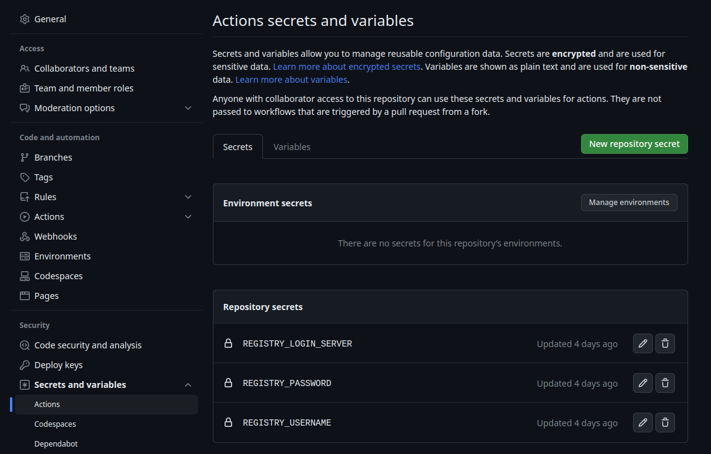

 ```
 __  __                    _   ____             _                  _ 
|  \/  | __ _ _ __ ___ ___| | | __ )  __ _  ___| | _____ _ __   __| |
| |\/| |/ _` | '__/ __/ _ \ | |  _ \ / _` |/ __| |/ / _ \ '_ \ / _` |
| |  | | (_| | | | (_|  __/ | | |_) | (_| | (__|   <  __/ | | | (_| |
|_|  |_|\__,_|_|  \___\___|_| |____/ \__,_|\___|_|\_\___|_| |_|\__,_|
                                                                     
```
Marcel Know How Backend Project
===============================
This projects holds the database-related files for Marcel's know how session.
The database holds the data related to general knowledge questions.


# Local Development Environment

## Using Visual Studio Code
Inside VSC hit Ctrl+Shift+P and search for `python: create environment`.
Select `.venv`, a Python executable with Python 3.10 or higher and choose to install the dependencies from the requirements.txt file.
You should be able to run and debug the Fast API server by hitting F5 on the main.py file.

## Without Visual Studio Code
It is recommened to create a virtual environment with Python 3.10 or higher.
Given you have Python installed run run the following command in the project's root:
```bash
python3 -m venv .venv
```
Activate the virtual environment with:
```bash
source .venv/bin/activate
```
Install the dependencies with:
```bash
pip install -r requirements.txt
```


# Shipping

## Import of Questions
To collect and import questions to the database the python script at 
`./db/questions_input/create_questions.py` is doing the job.
This script is  
- Querying questions from the OpenAI GPT-4 model
- Writes the question in JSON file
- Reads the JSON file and creates a cypher import file for neo4j

The cypher import file will be written to `./db/docker_image/import/questsions_import.cypher`.
To run the script you have to provide a valid OpenAI API key in a `.env` file in the project's root.

Example for `.env` file:
```
openai.api_key=<YOUR_KEY>
```
The database Dockerfile in `./db/docker_image/Dockerfile` will take the import file to create
the containing questions as new nodes in the database when the database container starts up.

## Docker Setup
Always _cd_ into `./db/docker_image`.
### Local Docker Environment

Build a local Docker image with:
```bash
docker buildx build -t marcel_knowhow_db .
```

Use the docker compose file with `docker-compose up -d` to start the backend.
Connect to local neo4j browser with `http://localhost:7474/browser/`.

### Image for Azure Container Registry and Azure Container Apps Service
Build the docker image with:
```bash
docker buildx build \
	--platform linux/amd64 \
	-t jnicontainerregistry.azurecr.io/marcel_knowhow_db \
	.
```

Push manually build image to registry
Use `docker push jnicontainerregistry.azurecr.io/marcel_knowhow_db:latest` to push the image to the registry.

### Continuous Integration and Deployment with GitHub Actions
TODO This is not yet implemented.
The project comes with a GitHub Actions workflow to build and push the image to the Azure Container Registry (see `./.github/workflows/db.yaml`).

To use push a new image to the Azure Container Registry set the three secrets in Github:
- REGISTRY_LOGIN_SERVER
- REGISTRY_USERNAME
- REGISTRY_PASSWORD



# Azure Container Apps Service
- Container app name `marcel-knowhow-db`
- Select the db image from the Azure Container Registry
- Use **0.5 CPU with 1 GB RAM** for the container
- Set environment variable `NEO4J_AUTH=none`
- Set environment variable `NEO4J_dbms_security_procedures_unrestricted=apoc.*`
- Enable Ingress
- Limit access to Container Apps Environment
- Choose **TCP**
- Set target and exposed port to `7687`
- After deployment copy the endpoint from Ingress tab for backend deployment