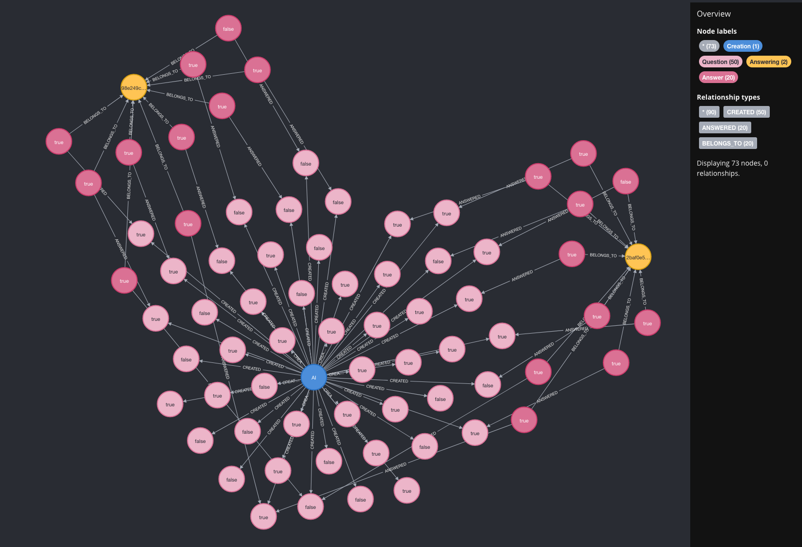
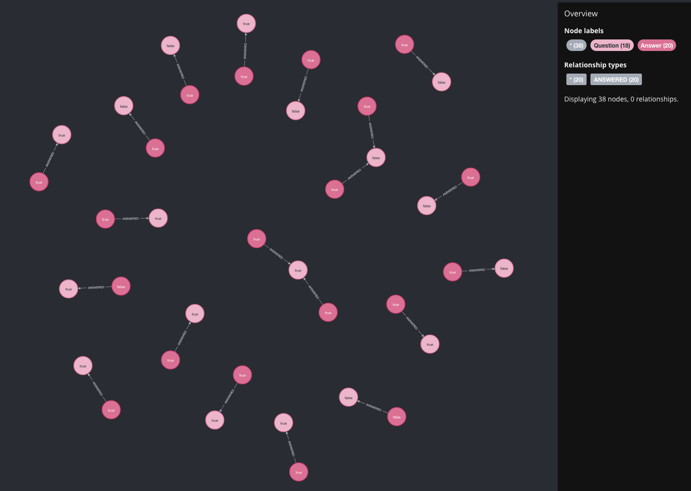

 ```
 __  __                    _   ____        _        _                    
|  \/  | __ _ _ __ ___ ___| | |  _ \  __ _| |_ __ _| |__   __ _ ___  ___ 
| |\/| |/ _` | '__/ __/ _ \ | | | | |/ _` | __/ _` | '_ \ / _` / __|/ _ \
| |  | | (_| | | | (_|  __/ | | |_| | (_| | || (_| | |_) | (_| \__ \  __/
|_|  |_|\__,_|_|  \___\___|_| |____/ \__,_|\__\__,_|_.__/ \__,_|___/\___|
                                                                     
```
Marcel Know How Database Project
===============================
This projects holds the database-related files for Marcel's know how session.
The database holds the data related to general knowledge questions in the answering results.

# Working with a Database (like Neo4j)
Use the neo4j browser at http://localhost:7474/browser/ to login an query the database. Such queries can be used inside and outside
of an app to create, update or delete data.

The query `MATCH (n) RETURN n` will return all nodes in the database.


Use `MATCH (q:Question)--(a:Answer) RETURN q,a` to return all questions which have answer(s).


To query the 10 questions with the longest reaction time in average use:
```cypher
MATCH 
	(q:Question)--(a:Answer)
RETURN 
	q.id AS ID, 
	q.question AS Question, 
	AVG(a.reaction_time_ms) AS AverageReactionTime
ORDER BY 
	AverageReactionTime DESC
LIMIT 10;
```
This results in something like:
```
╒═══╤══════════════════════════════════════════════════════════════════════╤═══════════════════╕
│ID │Question                                                              │AverageReactionTime│
╞═══╪══════════════════════════════════════════════════════════════════════╪═══════════════════╡
│26 │"Is Mount Etna located in Greece?"                                    │19896.0            │
├───┼──────────────────────────────────────────────────────────────────────┼───────────────────┤
│16 │"Did England win the Fifa world cup in 1966?"                         │6273.0             │
├───┼──────────────────────────────────────────────────────────────────────┼───────────────────┤
│20 │"Is the official language of Austria German?"                         │4384.0             │
├───┼──────────────────────────────────────────────────────────────────────┼───────────────────┤
│34 │"Did the Union of Soviet Socialist Republics (USSR) consist of 15 repu│4233.0             │
│   │blics?"                                                               │                   │
├───┼──────────────────────────────────────────────────────────────────────┼───────────────────┤
│45 │"Did Leonardo da Vinci originate from France?"                        │4101.0             │
├───┼──────────────────────────────────────────────────────────────────────┼───────────────────┤
│33 │"Is the Swiss Guard responsible for the safety of the Pope?"          │3844.0             │
├───┼──────────────────────────────────────────────────────────────────────┼───────────────────┤
│47 │"Did the Viking age end in the 11th century?"                         │3843.0             │
├───┼──────────────────────────────────────────────────────────────────────┼───────────────────┤
│24 │"Did the Hundred Years' War between England and France last exactly 10│3806.0             │
│   │0 years?"                                                             │                   │
├───┼──────────────────────────────────────────────────────────────────────┼───────────────────┤
│7  │"Did Spain remain neutral during both World Wars?"                    │3746.0             │
├───┼──────────────────────────────────────────────────────────────────────┼───────────────────┤
│21 │"Was the Magna Carta signed in the 13th Century?"                     │3259.0             │
└───┴──────────────────────────────────────────────────────────────────────┴───────────────────┘
```

# Dependency to Main Project
This project depends indirectly on the main project 
[Marcel Knowhow Main](https://github.com/PRODYNA/marcel_knowhow_main). 
The main project holds a script to create and distribute AI generated questions to this database 
project (into the folder `./neo4j_import/questions_import.cypher`).

# Shipping

## Database Import of AI generated Questions
As mentioned above the cypher import file will be written to `./neo4j_import/questions_import.cypher`.
The database Dockerfile in `./db/docker_image/Dockerfile` will take the import file to create
the containing questions as new nodes in the database when the database container starts up.
The script `neo4j_scripts/import.sh` will be installed in the Docker image to execute the import
when the container starts up.

## Docker Setup

### Local Docker Environment
Build a local Docker image with:
```bash
docker buildx build -t marcel_knowhow_db .
```

Use the docker compose file with `docker compose up -d` to start the backend.
Connect to local neo4j browser with `http://localhost:7474/browser/`.

### Image for Azure Container Registry and Azure Container Apps Service
Build the docker image with:
```bash
docker buildx build \
	--platform linux/amd64 \
	-t jnicontainerregistry.azurecr.io/marcel_knowhow_db \
	.
```

Push manually build image to registry
Use `docker push jnicontainerregistry.azurecr.io/marcel_knowhow_db:latest` to push the image to the registry.

### Continuous Integration and Devlivery with GitHub Actions
The project comes with a GitHub Actions workflow to build and push the image to the Azure Container Registry (see `./.github/workflows/db.yaml`).

To use push a new image to the Azure Container Registry set the three secrets in Github:
- REGISTRY_LOGIN_SERVER
- REGISTRY_USERNAME
- REGISTRY_PASSWORD


# Azure Container Apps Service
- Deploy as a sidecar container `marcel-knowhow-db`
- Select the db image from the Azure Container Registry
- Use **0.5 CPU with 1 GB RAM** for the container
- Set environment variable `NEO4J_AUTH=none`
- Set environment variable `NEO4J_dbms_security_procedures_unrestricted=apoc.*`